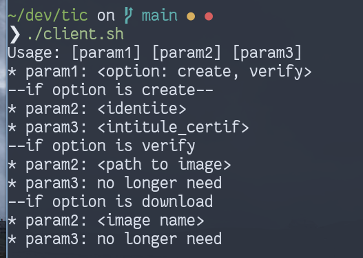

# Risk analysis

| Assets           |                         | Vulnerability      |
|------------------|-------------------------|--------------------|
| Primary assets   |                         |                    |
|                  | CA certificate          |                    |
|                  | Server Certificate      |                    |
|                  | ISP (internet provider) | Connection failure |
|                  | Password private key    | Exposed password   |
| Secondary assets |                         |                    |
|                  | FreeTSA service         | TSA is not trusted |
|                  | Google chart API        | Deprecated         |
|                  | LAN                     | Connection failure |

Table: (Risk Analysis)

# Usage

Run the `init.sh` script to generate all the CA, ts and images needed in this project.

## Client

We create a client script providing option for user (run `client.sh`)



**Example**
```bash
./client.sh create "Do Hoang" "Cryptis Info"
./client.sh download "dohoang.png"
./client.sh verify "dohoang.png"
```

## Manually

**Run web server**

```bash
python Web_Service.py
```

**Run frontal server**
```bash
socat openssl-listen:9000,fork,cert=CA/bundle_server.pem,cafile=CA/ecc.ca.cert.pem,verify=0 tcp:127.0.0.1:8080
```

**Create certificate**

```bash
curl -X POST -d 'identite=DO Hoang' -d 'intitule_certif=CRYPTIS INFO' --cacert CA/ecc.ca.cert.pem https://localhost:9000/creation
```

**Download the attestation and save as `dohoang.png`**

```bash
curl -v -o dohoang.png --cacert CA/ecc.ca.cert.pem https://localhost:9000/fond
```

**Verify the certificate**

```bash
curl -v -F image=@dohoang.png --cacert CA/ecc.ca.cert.pem https://localhost:9000/verification
```
