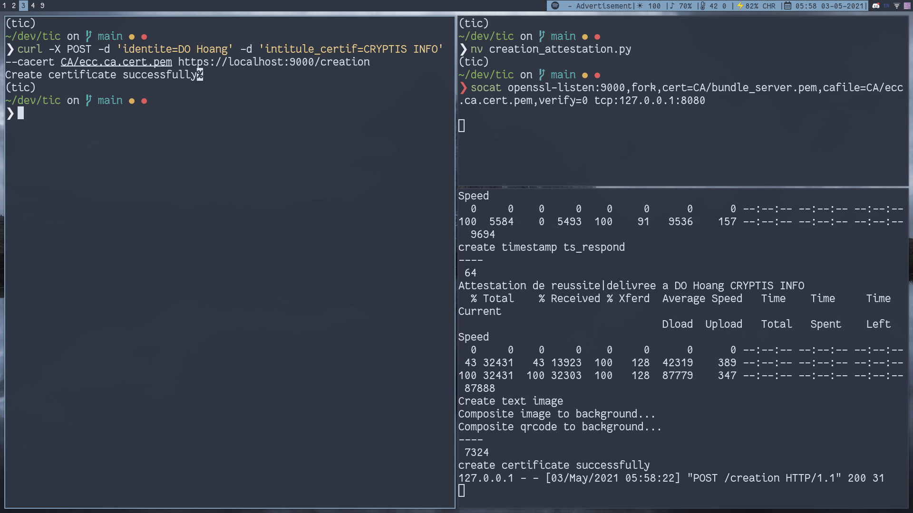
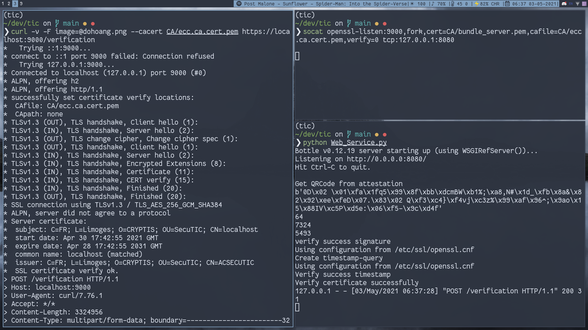

---
title: "Securite TIC Projet - CertifPlus"
author: \textbf{DO Duy Huy Hoang} \newline
				\textbf{NGUYEN Thi Mai Phuong} \newline
        \newline
        \textit{University of Limoges} \newline 
date: \today
titlepage: false
header-includes: |
    \usepackage{multicol}
    \usepackage{graphicx}
footer-left: DO Hoang et Mai Phuong
mainfont: NewComputerModern
sansfont: NewComputerModern
monofont: Dank Mono
caption-justification: centering
...
\pagenumbering{Roman} 

\newpage{}
\listoftables
\newpage{}
\listoffigures
\newpage{}
\tableofcontents
\newpage{}

\pagenumbering{arabic} 

\vspace{3cm}
\newpage{}

\pagenumbering{arabic} 

# I. Introduction

In this project, we are suppose to implement a distribution processsecure electronic certificate of success for CertifPlus company.


## Objectives 

- An user can:
	- request to create a certificate with their information
	- download their certificate
	- verify an existing certificate

- The authenticity of the certificate issued electronically in the form of an image must be guaranteed:
	- The image contains visible information :
		- The name of the person receiving the certificate of achievement
		- The name of the successful certification
		- A QRcode containing the signature of this information
	- The image contains hidden information :
		- tamper-proof information is concealed by steganography in the image. This information includes the visible information of the certificate as well as the guaranteed delivery dateby a *timestamp* signed by a time stamping authority [**freetsa**](www.freetsa.org)

- Verification
	- extract and the stamp concealed in the image by steganography and verify timestamp
	- checks the signature encoded in the QRcode

# II. Programs, Materials, Methodologies 

## 2.1 Programs and Materials

- Python 3.8
- bottle - For Web Services
- qrcode, numpy, Pillow, zbarlight for qrCode creation, verification and image modification
- a stenography library provided in this project
- socat - multipurpose relay tool

## 2.2 Methodologies

### A. Creating certficate

An user will request CertifPlus for creating a certificate by providing his/her informations containing Last name and First name, Institue.

First of all, we sign their signature using `SHA-256` with binary file output and using encrypted CA key by using the inforBlock containing the user name and the institute which is extended as 64 characters string.

```bash
$ openssl dgst -sha256 -sign CA/enc.ecc.ca.key.pem ./CA/info.txt > ./CA/signature.sig
```

This signature after that will be used to create a `TimeStampRequest` file, which contains a hash of this signature file that we want to sign.

```bash
$ openssl ts -query -data file.png -no_nonce -sha512 -cert -out file.tsq
```

Then we send the `TimeStampRequest` file to [*freeTSA*](freeTSA.org) and receive a `TimeStampResponse` file which is going to be used as a stegano message later.

```bash
$ curl -H "Content-Type: application/timestamp-query" --data-binary '@file.tsq' https://freetsa.org/tsr > file.tsr
```

We also use that signed signature to create a QRcode containing this informations and then combining the text image that received by using google chart API with their `inforBlock` that we mentioned earlier, QRcode and attestation font provided in this project.

The stegano message is contained the infor block and `TimeStampResponse` which is converted to *ascii*.
Finally, the certificate will be create.

**Result**



### B. Verify certificate

In this part, an user will request CertifPlus for verifying his/her certificate by providing his/her cert.

For verify the signature, we firstly need to extract the data from the QRcode by using `Pillow` library in Python to crop the exact QRcode from the certificate. Then using `zbarlight` to extract the data. 

We also need to recover the message hidden in the certificate by using a stegano library provided in this project. Because we have already know the len of the message which is 64 bytes (for the infor block) and the fixed timestamp size ( which is 7324 ) so that it is easy to extract exact the infor block and the timestamp respond.

By using the signature which is recovered from QRcode and the infor block extracted from the stegano message, we can easily verify the signature with the CA public key.

```bash
$ openssl dgst -verify CA/ecc.ca.pubkey.pem -signature signature.sig info.txt
```

To verify timestamp, we have already verify the signature is valid or not, we use this signature as the data for creating a `TimeStampRequest` file (same as in creating certificate part). Next, with the public Certificates(provided by [*freeTSA*](freeTSA.org)) you can verify the `TimeStampRespond`.

```bash
$ openssl ts -verify -in file.tsr -queryfile file.tsq -CAfile cacert.pem -untrusted tsa.crt
```
 


# III. Usage

Firstly, we run the `init.sh` script to generate all the CA, ts and images needed in this project.

**Run web server*

```bash
python Web_Service.py
```

**Run frontal server**
```bash
socat openssl-listen:9000,fork,cert=CA/bundle_server.pem,cafile=CA/ecc.ca.cert.pem,verify=0 tcp:127.0.0.1:8080
```

**Create certificate**

```bash
curl -X POST -d 'identite=DO Hoang' -d 'intitule_certif=CRYPTIS INFO' --cacert CA/ecc.ca.cert.pem https://localhost:9000/creation
```

## Download the attestation and save as *myatt.png*

```bash
curl -v -o dohoang.png --cacert CA/ecc.ca.cert.pem https://localhost:9000/fond
```

## Verify the attestation

```bash
curl -v -F image=@dohoang.png --cacert CA/ecc.ca.cert.pem https://localhost:9000/verification
```